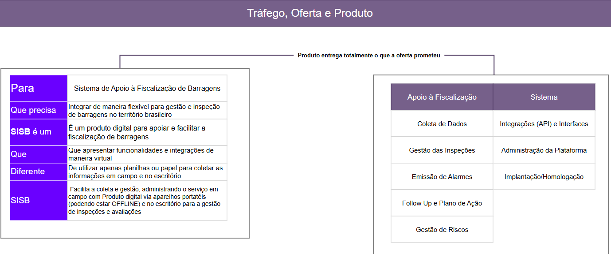
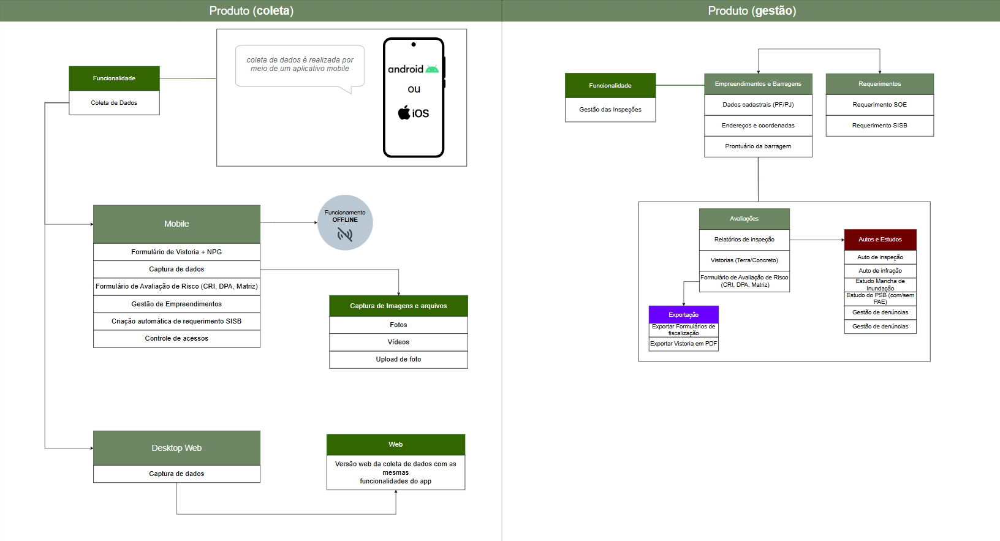

# SISB — Tema WordPress

Tema institucional premium do **SISB (Sistema Integrado de Fiscalização de Barragens)**. Landing page single-page com formulário de solicitação de demonstração integrado ao `wp_mail`.
## Utilizado como referencia para textos e direcionamentos os módulos presentes no contrato.



--

## Resumo de Gestão e Coleta, principais diferenciais:



--

## Instalação

1. No painel do WordPress, acesse **Aparência → Temas → Adicionar novo → Enviar tema**.
2. Envie o arquivo `sisb-theme.zip` e clique em **Instalar agora**.
3. Clique em **Ativar**.
4. Vá em **Configurações → Leitura → Sua página inicial exibe** → selecione **Uma página estática** (opcional; a home usa `index.php` do tema por padrão).

## Configuração do formulário

O formulário "Solicitar Demonstração" envia por **wp_mail** para o endereço configurado.

Defina o destinatário em:

- **Configurações → Geral → E-mail do formulário SISB**

Ou, via `wp-config.php`:

```php
define( 'SISB_CONTACT_EMAIL', 'seuemail@dominio.gov.br' );
```

Se nenhum for definido, o e-mail do administrador do site é usado.

## Requisitos

- WordPress 5.6+
- PHP 7.4+
- Servidor com envio de e-mail habilitado (recomendado: plugin de SMTP como *WP Mail SMTP* para melhor deliverability).

## Segurança

- Nonce do WordPress em cada envio.
- Sanitização de todos os campos.
- Campo honeypot invisível contra bots.
- E-mail do remetente = `no-reply@seudominio` com `Reply-To` do lead.

## Personalização

- Cores, fontes e tokens no topo de `style.css` (variáveis CSS).
- Textos institucionais em `index.php` (todos traduzíveis via `__()`).
- Imagem do dashboard: substitua `assets/sisb-dashboard.png`.

## Estrutura

```
sisb-theme/
├── style.css          # Cabeçalho do tema + design system
├── functions.php      # Enqueue, handler do formulário, helper de ícones
├── header.php         # Cabeçalho / nav
├── footer.php         # Rodapé
├── index.php          # Landing page completa
├── screenshot.png     # Preview no admin
└── assets/
    ├── main.js        # Menu mobile
    └── sisb-dashboard.png
```
